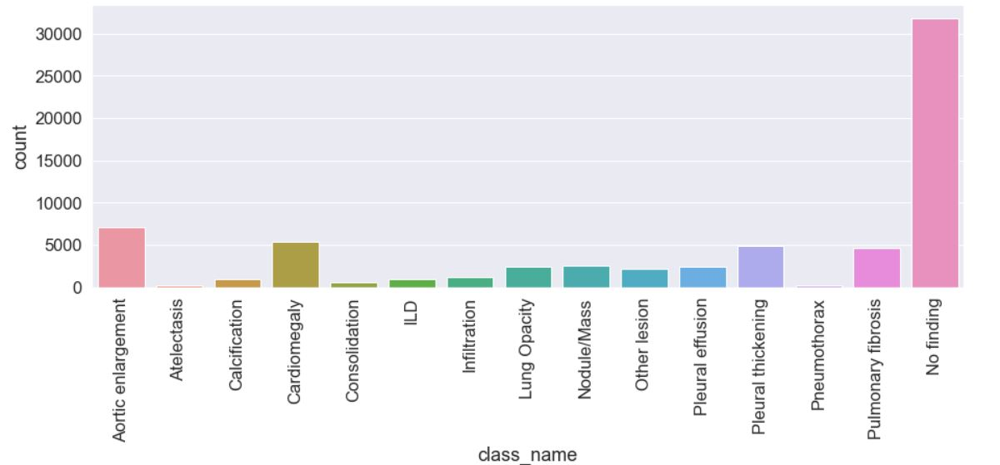
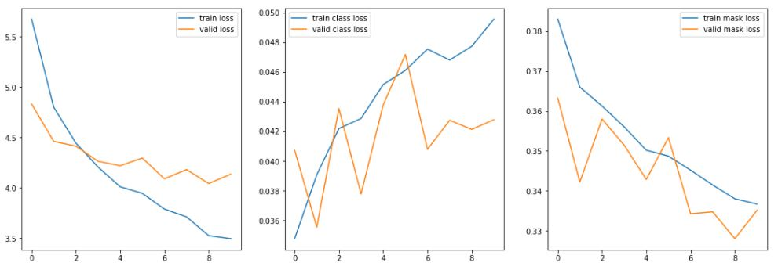
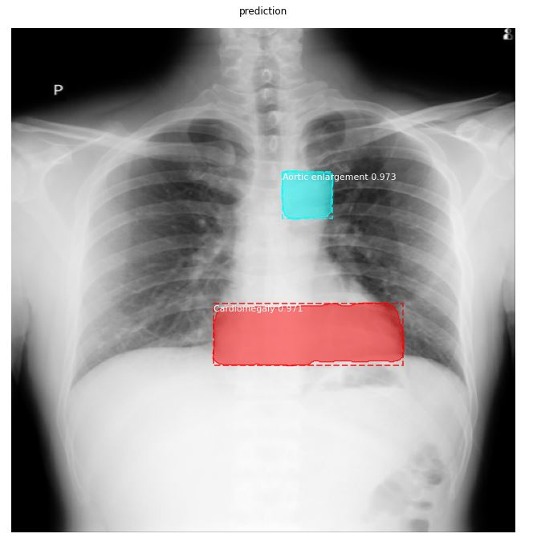
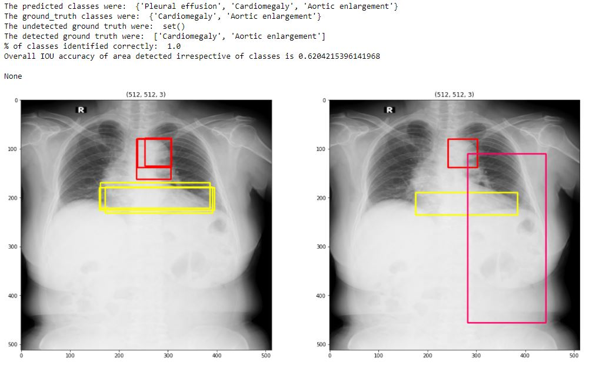
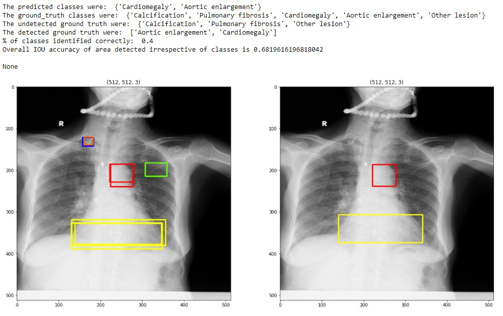

# Mask-RCNN - X-ray Abnormalities Detection

## Index

1. [Mask-RCNN and Dataset used](#Brief)
2. [Overview of folder structure](#overview)
3. [Overview of key findings from the EDA conducted in Task 1](#key-finding)
4. [Evaluation of the model](#model-evaluation)
5. [References](#references)


## <a name='brief'>1. Mask-RCNN and Dataset used</a>

Mask-RCNN extends faster R-CNN by adding a branch for predicting an object mask in parallel with the existing branch for bounding box recognition.

It is used in this project for instance segmentation to classify each pixel into a fixed set of categories. The backbone architecture used is ResNet50.

The dataset provided by Vingroup Big Data Institute comprise of 14 types of thoracic abnormalities from chest radiographs to be localised and classified.

## <a name='overview'>2. Overview of folder structure</a>

An overview of the folder structure is as below:


```flow
|--mrcnn
|   |-- init.py
|   |-- config.py
|   |-- model.py
|   |-- parallel_model.py
|   |-- utils.py
|   |-- visualize.py
|-- logs (not included)
|   |-- mask_rcnn_shapes_rev.01.h5
|-- test (imgs not included)
|-- train (imgs not included)
|-- README.md
|-- data_preprocessing_resizing.ipynb
|-- maskrcnn_df_resize_compilation.ipynb
|-- model_output_bounding_boxes.ipynb
|-- model_output_masks.ipynb
|-- train.ipynb (not included)
|-- train_512.csv (not included)
|-- train_scaled_rev.01.csv (not included)
```


## <a name='key-finding'>3. Key findings from the EDA conducted</a>

It is observed that most of the images provided has no findings, with aortic enlargement and cardiomaegaly as the next highest counts.

The dataset is unbalanced and may be re-sampled or using other techniques such as under-sampling, k-fold cross validation, etc.




## <a name='model-evaluation'>4. Evaluation of models developed</a>

The mask RCNN model was trained for 10 epochs. The best epoch was 8 with a validation loss of 4.042



A sample mask output from an x-ray image below:



Sample bounding box outputs from x-ray images below:





The model may be further improved with techniques such as addressing the unbalanced dataset, training for more epoches and modifying the learning rates.

## <a name='references'>5. References</a>
1. Mask RCNN Paper: https://arxiv.org/abs/1703.06870
2. Dataset: https://www.kaggle.com/c/vinbigdata-chest-xray-abnormalities-detection
3. Code Reference: https://github.com/matterport/Mask_RCNN